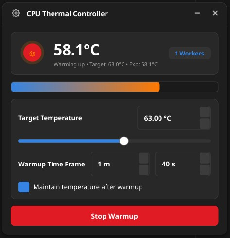
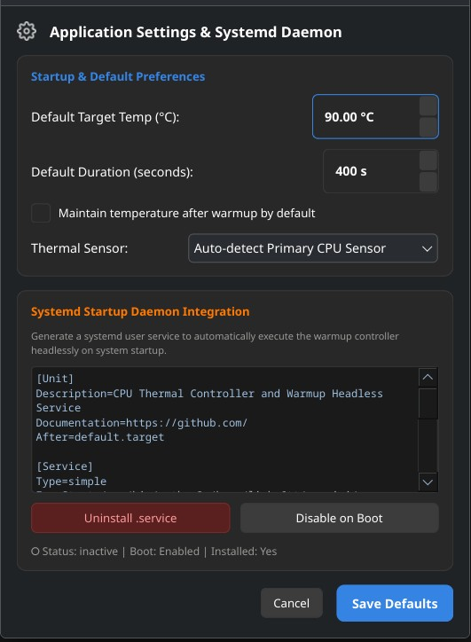

# Heat My Desktop (HMD)
**Heat My Desktop allows you to control your desktop's temperature, reaching a target temperature along a controlled curve. This is especially useful for preventing cold-boot crashes, fixing silicon thermal expansion instability, or running a controlled CPU stress test.**

*This project was made with the help of AI.*

**Heat My Desktop** allows you to control your desktop's temperature, reaching a target temperature along a controlled curve in a defined timeframe and maintaining it if needed.

Heat My Desktop also allows you to run as a daemon on startup automatically.

*Note: This software cannot cool your PC below room temperature.*

Here is what the application looks like, along with the settings for the daemon installation:





---

### ⚠️ Important Limitations and Hardware Behavior
- **Laptop Thermal Throttling:** On most modern laptops (and thin-and-lights), firmware-level protections (like Intel DPTF or Arch's `thermald`) actively block you from increasing temperatures past a certain chassis limit (usually 60°C - 65°C). The OS will aggressively downclock your CPU frequency to keep the chassis cool. If your laptop gets "stuck" at 62°C, this program is working properly—it's simply hitting your manufacturer's hardcoded thermal ceiling.
- **Maximum Temperature Limits:** Depending on your CPU and your cooling solution, you may not be able to reach extremely high temperatures (e.g., 90°C or 100°C). This software performs **controlled stress testing** by saturating 100% of your CPU threads and memory controllers. It does **not** overclock your CPU or bypass motherboard power limits. If you have a beefy desktop cooler or a custom loop, your maximum reachable temperature might only be 60°C under full synthetic load.

> **HARDWARE DISCLAIMER: PLEASE READ CAREFULLY**
>
> **This tool intentionally generates heat by applying massive memory thrashing and CPU stress using multiprocessing floating-point calculations.**
> **While hardcoded safety failsafes (an absolute kill-switch at 90.0°C) and silent desktop notifications to warn the user are built in, you use this software entirely at your own risk. The authors assume no liability for hardware damage or instability resulting from its use.**

---

## Why would I need this ?

- **Damaged-Pin CPU Workaround**: If you have a damaged-pin CPU, thermal expansion may help prevent crashes once the silicon has heated properly. This app allows you to automate this warmup on startup.
- **Thermal & Stability Stress Testing**: You may also want to use this app to stress test at a certain temperature to evaluate cooling, paste performance, and fan profiles.
- **Makeshift Heater**: Simply use your computer as a makeshift heater to warm up your desk or room during cold seasons.

*Important: This is a heater, not a cooler; you cannot reach below starting temperature with this.*

---

## Key Highlights

- **Smooth Curve Trajectory**: Calculates an expected target temperature curve over your specified timeframe instead of abruptly overheating the processor.
- **Continuous Temperature Maintenance**: If temperature maintenance is enabled, the utility stays active in maintenance mode—even if your CPU is already at or above target temperature at boot—dynamically engaging workers whenever the temperature dips below the target.
- **Startup Daemon Integration**: Easily configure and run headlessly on system startup via systemd user services. Automatically handles legacy service cleanups, restarts active units on settings update, and keeps temperature maintained across sessions.
- **Modern GNOME Aesthetic**: Clean rounded frameless widget matching modern Adwaita Dark styling with a live pulsating heating indicator.
- **Hardcoded 90.0°C Safety Kill-Switch**: Instantly terminates all worker processes if CPU temperature reaches 90°C.
- **Silent Notifications**: Sends low-urgency desktop notifications on warmup start, completion, and safety cutoffs.

---

## How to install and use

## Installation

**Arch Linux / Manjaro (Recommended)**
*(Note: Direct AUR installation is temporarily unavailable until the Arch team lifts the registration freeze).*

You can easily install this utility natively using Arch's package builder:

1. Clone the repository:
```bash
git clone https://github.com/Linky6tt/heat-my-desktop.git
```
2. Navigate to the directory and build the package:
```bash
cd heat-my-desktop
makepkg -si
```

#### Manual Installation / Prerequisites
Make sure python3, pyqt6, and lm-sensors are installed on your Linux distribution:

- **Ubuntu / Debian / Linux Mint**:
  ```bash
  sudo apt install python3 python3-pyqt6 lm-sensors
  ```
- **Fedora**:
  ```bash
  sudo dnf install python3 python3-pyqt6 lm_sensors
  ```

Once the prerequisites are installed, clone the repository and run the script manually:
```
git clone https://github.com/Linky6tt/heat-my-desktop.git
cd heat-my-desktop
python3 main.py
```
---

### 1. Launching the GUI Widget

- **From Application Launcher**: Search for **Heat My Desktop** or **HMD** in your GNOME / KDE / OTHER search bar.
- **From Terminal**:
  ```bash
  python3 main.py
  ```

**Widget Controls**:
- **Target Temperature**: Set your desired target temperature (clamped between 30°C and 90°C).
- **Warmup Time Frame**: Set your warmup duration (up to 60 minutes).
- **Maintain Temperature**: Toggle this ON if you want the app to hold the target temperature after warmup completes.
- **Start / Stop**: Click the main action button to begin or stop the warmup cycle.
- **Settings (Cogwheel)**: Set startup default values, select a specific temperature sensor, and install/uninstall the systemd startup daemon with one click.

---

### 2. Running Headlessly from Terminal

Execute warmups directly from the command line without opening a graphical window:

- **Standard Warmup**:
  ```bash
  # Warm up CPU to 55°C over 5 minutes (300 seconds)
  python3 main.py --headless --target 55 --duration 300
  ```

- **Warmup and Maintain**:
  ```bash
  # Warm up CPU to 60°C over 10 minutes and maintain it continuously
  python3 main.py --headless --target 60 --duration 600 --maintain
  ```

- **Warmup without Maintaining**:
  ```bash
  # Warm up CPU to 55°C and exit immediately once complete
  python3 main.py --headless --target 55 --duration 300 --no-maintain
  ```

- **Inspect Hardware Sensors**:
  ```bash
  # List all detected temperature sensors and show primary CPU sensor
  python3 main.py --status
  ```

> **Note on Maintenance Mode**: When `--maintain` is enabled, the daemon stays running indefinitely to keep the CPU at or above the target temperature. If your CPU starts already warm (at or above target), it enters maintenance mode immediately and waits for the temperature to drop before engaging workers.

---

### 3. Running Automatically on Startup (Systemd Daemon)

Configure Heat My Desktop to run headlessly in the background on boot:

- **Install and Enable Service**:
  ```bash
  python3 main.py --install-service
  python3 main.py --enable-service
  ```

- **Check Service Status and Logs**:
  ```bash
  systemctl --user status heat-my-desktop.service
  journalctl --user -u heat-my-desktop.service -f
  ```

- **Uninstall Service**:
  ```bash
  python3 main.py --uninstall-service
  ```
*(You can also easily install, configure, enable, or uninstall the service directly from the Settings cogwheel menu inside the GUI. Updating and saving settings will automatically reconfigure and restart any active service.)*

---

### 4. Running the Tests

Run the full automated unit test suite:
```bash
python3 -m unittest discover -s tests
```
